# Gmsh-collection
A collection of geo-files for gmsh

Below you can see the images of the meshes generated by gmsh from the geo-files.

**BackwardFacingStep.geo**

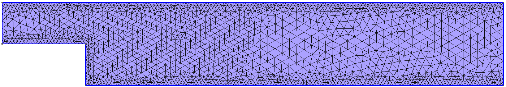

**BlasiusFlowProblem.geo**

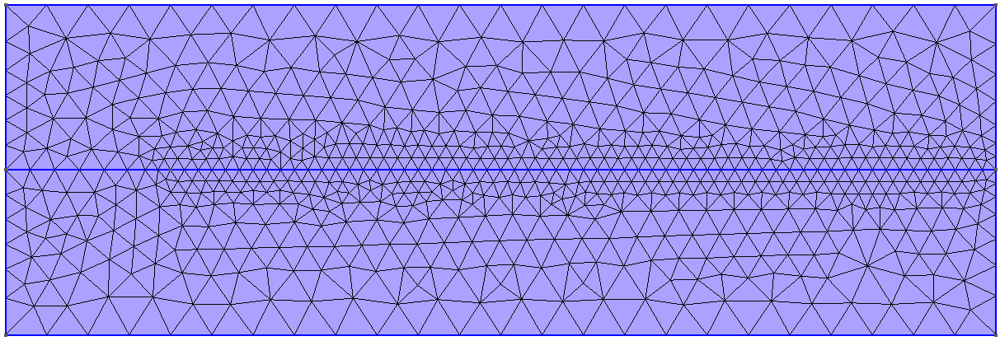

**CubeThreeMaterials.geo**

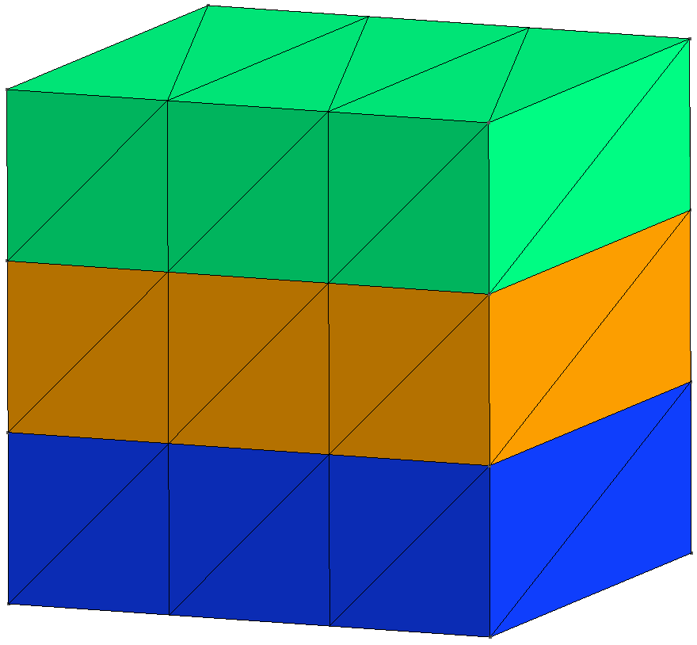

**Cylinder.geo**

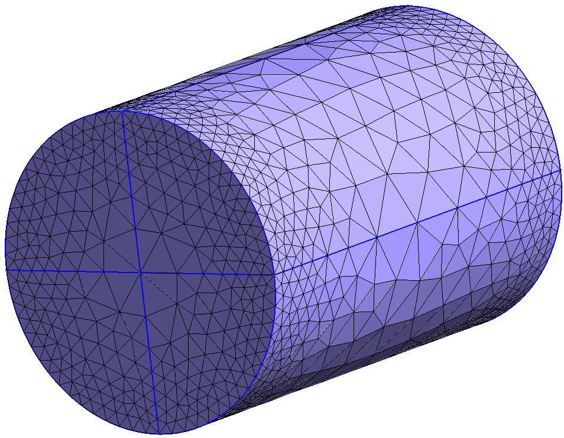

**DFGBenchmark.geo**

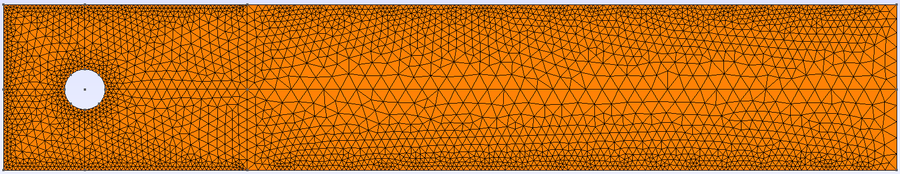

**HollowCylinder.geo**

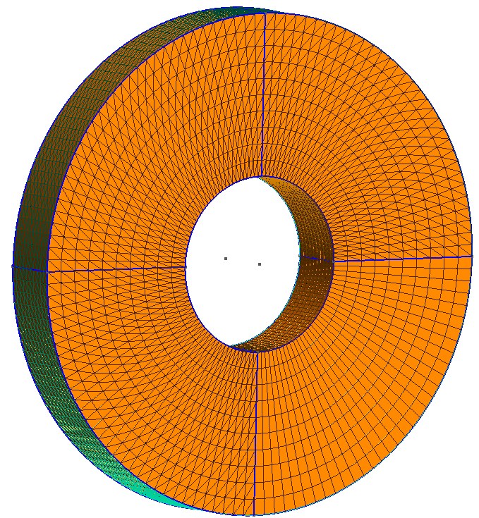

**HollowSphere.geo**

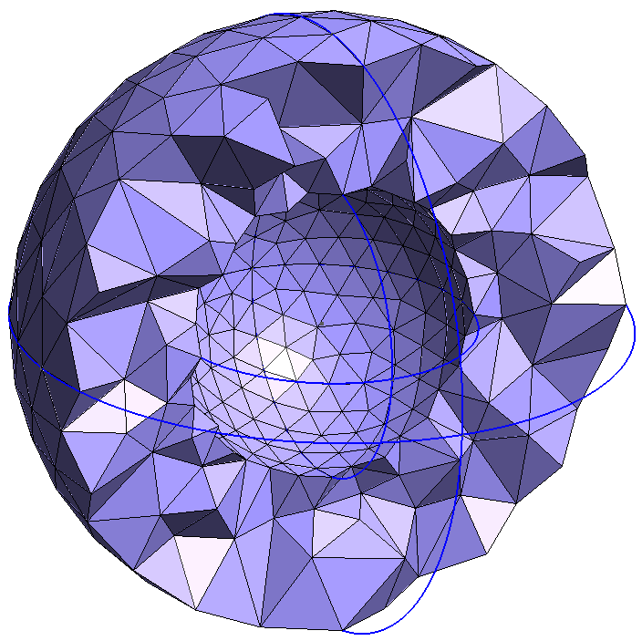

**HorseShoe.geo**

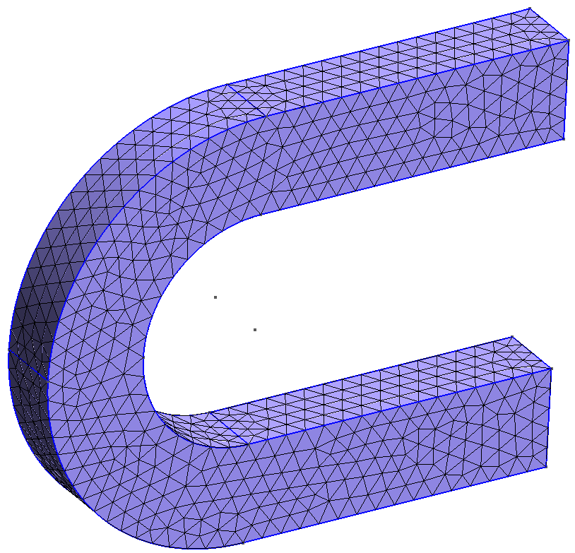

**RectangleInletOutlet.geo**

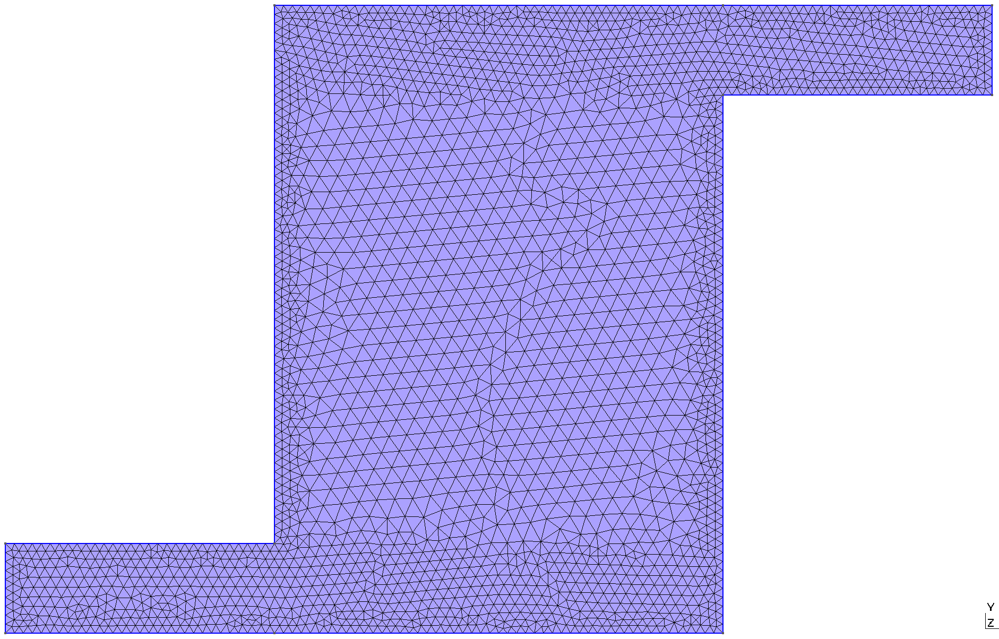

**RectangleTwoMaterials.geo**

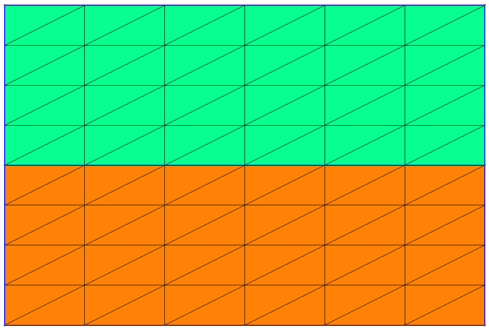

**Stenosis.geo**

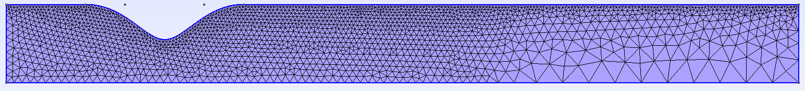

**Tire3DSegment.geo**

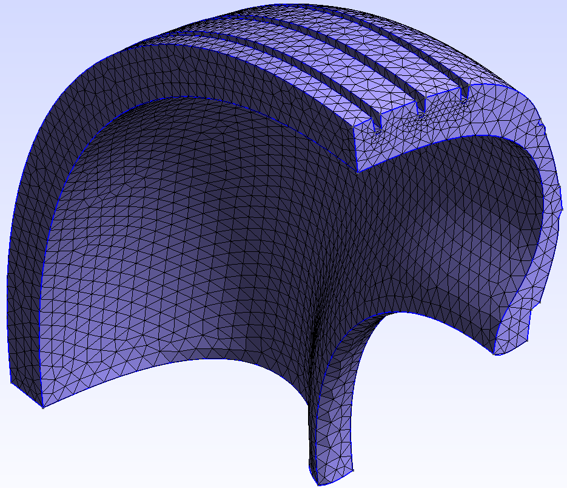

**Tire3DExtrusion.geo**

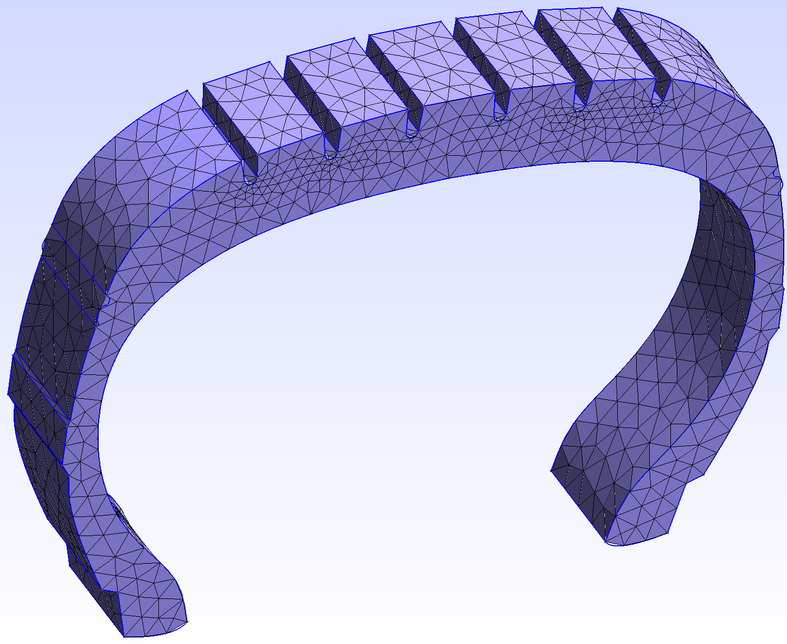

**Balloon2D.geo**

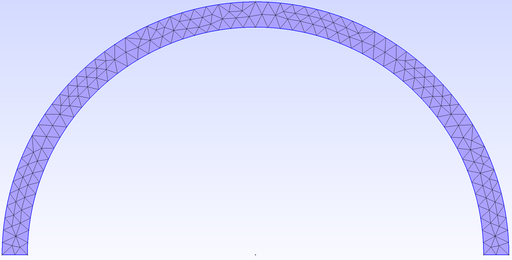

**Balloon3D.geo**

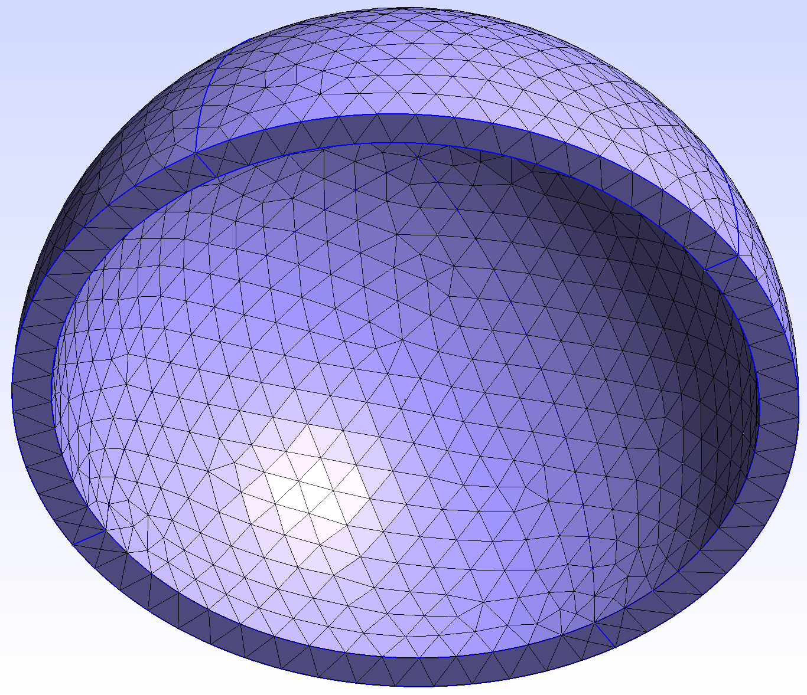

