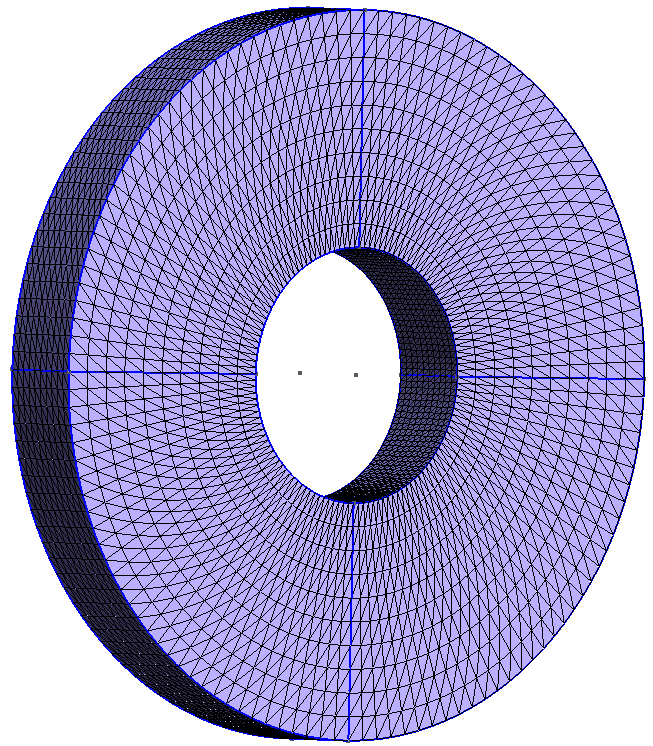

# Gmsh-collection
A collection of geo-files for gmsh

Below you can see the images of the meshes generated by gmsh from the geo-files.

**HorseShoe.geo**

**DFGBenchmark.geo**

**HollowCylinder.geo**

**HollowSphere.geo**

**HorseShoe.geo**

